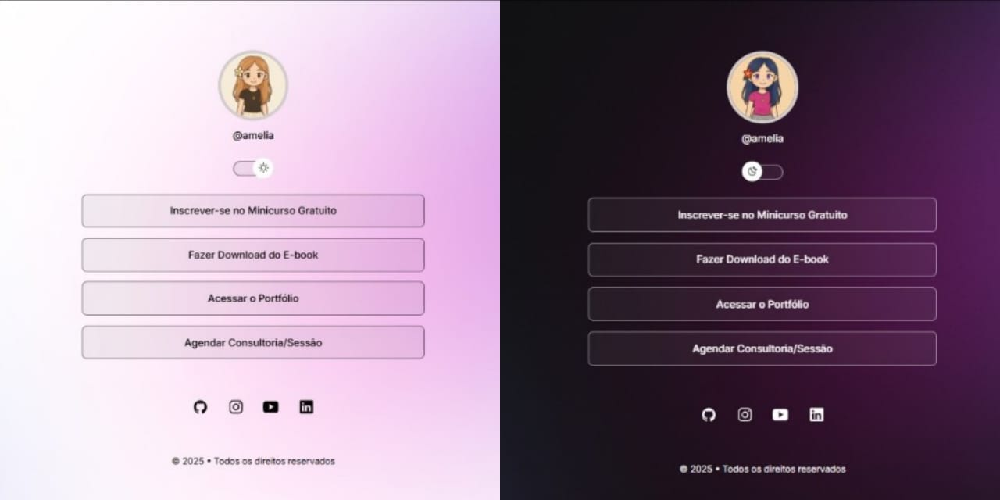

# 🔗 Linktree – Aplicação Front-End

Aplicação Front-End desenvolvida com HTML, CSS e JavaScript, com foco na organização de links, alternância de tema e experiência do usuário.

## 📸 Preview


## 🛠️ Tecnologias
- HTML5
- CSS3
- JavaScript

## ✨ Destaques
- Alternância entre tema claro e escuro
- Manipulação do DOM para controle de estado visual
- Uso de variáveis CSS para gerenciamento de temas
- Layout responsivo para diferentes dispositivos
- Transições e animações para uma experiência mais fluida

## 📚 Objetivo
Projeto desenvolvido com fins educacionais, com foco no aprimoramento de:
- Estruturação de interfaces responsivas
- Organização e reutilização de estilos
- Interatividade utilizando JavaScript puro
- Desenvolvimento de interfaces modernas

## 📱 Responsividade
A aplicação se adapta a diferentes tamanhos de tela, mantendo consistência visual e usabilidade.

## 🚀 Execução do Projeto
```bash
# Clone o repositório
git clone https://github.com/mellacer/LinkTree

# Acesse a pasta
cd LinkTree

# Abra o index.html no navegador
